# Informe Parcial — AuraMap

Curso DevOps, UTEC 2026-2. Repositorio: <https://github.com/AaronCoorahua/aura-map>

> Todas las capturas están en [`imagenes/`](../imagenes/) y se tomaron con el
> proyecto corriendo de verdad (`./devops.sh docker`) sobre la rama `develop`.

## a) Título y descripción del proyecto y del equipo

**Nombre del producto:** AuraMap — el "Airbnb de las batallas de aura".

> *"No es quién grita más fuerte, es quién pierde la compostura primero."*

**Problema y solución:** organizar una batalla de aura hoy se coordina a
mano (grupos de chat, historias de Instagram, TikToks con la ubicación en los
comentarios, boca a boca), sin un lugar central donde ver qué batallas hay
cerca, cuánto cupo queda o si tienen permiso municipal para no terminar
desalojados por serenazgo a mitad del duelo. AuraMap resuelve esto con una
app web mínima (sin login, sin pagos) donde:

- un organizador publica una batalla con lugar, fecha, cupo y si tiene
  permiso municipal;
- cualquiera busca batallas cercanas en un mapa (Leaflet + OpenStreetMap),
  filtra por distrito o por radio en kilómetros, y se inscribe con control de
  cupo y sin duplicarse.

**Integrantes y roles:**

| Persona | Integrante (GitHub) | Rol DevOps | Responsabilidad principal |
|---|---|---|---|
| A | Rubén Coorahua (`@AaronCoorahua`) | Release Manager / Integración | GitFlow, protección de ramas, Conventional Commits, revisión de PRs, release y tag. |
| B | Leonardo Candio (`@kndyy`) | QA & Test Automation | Estrategia de pruebas, pytest y cobertura, pipeline de CI. |
| C | J. Josnayo (`@jjosnayo2102`) | Platform / Container Engineer | Dockerfile, `compose.yaml` (redes, secretos, volumen, healthcheck) y `devops.sh`. |

Los tres desarrollan features de producto además de su rol; el rol define de
qué responde cada uno y qué revisa con más rigor en los Pull Requests.

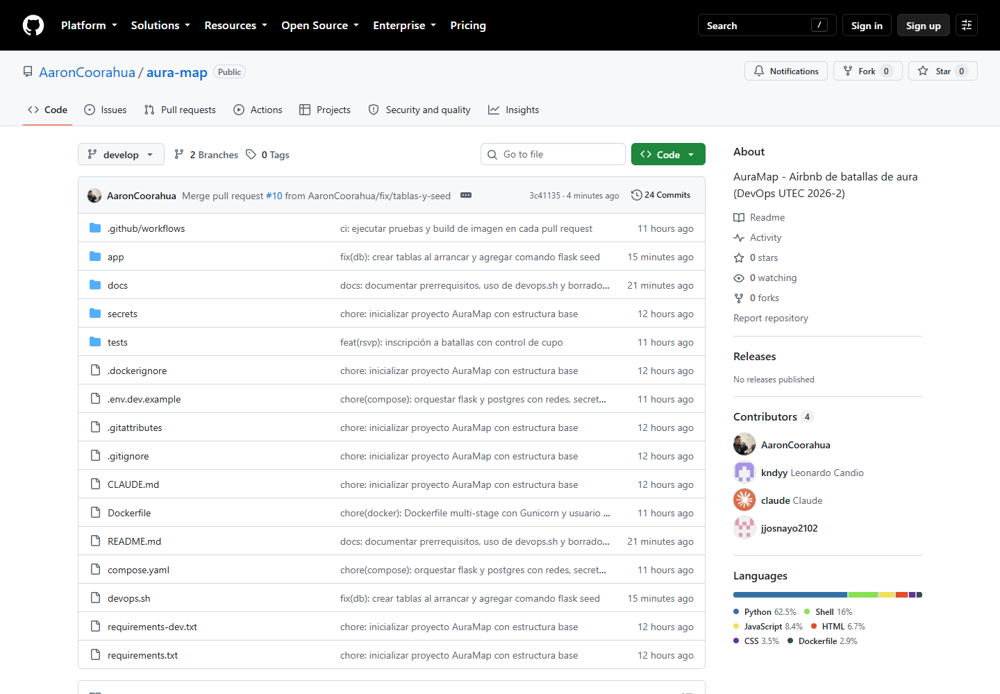

## b) Justificación de la elección del tema

**El meme que se volvió plan de fin de semana.** Desde 2024 el "aura" pasó
de ser una palabra esotérica a la moneda social de la Gen Z y la Gen Alpha:
en TikTok, Instagram y en cualquier salón de clases se reparten "+1000 de
aura" por hacer algo con estilo y se quita "-500 de aura" por tropezarse
frente a todos. En 2025 explotó el *aura farming* (acumular aura a propósito
con pose, calma y actitud de protagonista de anime), y lo que empezó como
comentarios en videos se convirtió en algo presencial: grupos de jóvenes que
se juntan en un parque o una plaza para medirse en **batallas de aura** —
duelos de presencia, estilo y compostura donde el público decide quién se
lleva los puntos.

**El problema real detrás del meme.** Hoy esas batallas se organizan con un
flyer en historias que dura 24 horas, un grupo de WhatsApp que explota y una
dirección pasada por DM. Pasa siempre lo mismo: los que *quieren participar*
no saben si queda cupo, los que solo *quieren ir a ver* no se enteran a tiempo
o no saben si les queda cerca, y los organizadores no pueden decir si tienen
permiso municipal (clave para que serenazgo no corte el evento). Es la misma
necesidad que resolvió Airbnb con los alojamientos: un mapa, una ficha clara y
un botón para reservar tu lugar.

**Por qué este tema para un curso de DevOps.** El curso pide construir un
proyecto real con un flujo DevOps completo (Git con convenciones, pruebas
automatizadas, CI y contenedores) en equipos de 3 con roles diferenciados.
AuraMap encaja perfecto:

- **Dominio simple de modelar** (batalla, ubicación, inscripción) que no se
  come el tiempo que necesitamos para la parte de DevOps.
- **Reglas de negocio que sí se pueden probar**: fecha futura, cupo entre 1 y
  100, coordenadas válidas, distancia por fórmula de Haversine, cupo lleno y
  sin inscripciones duplicadas. Eso nos dio 15 pruebas con sentido y no
  pruebas de relleno.
- **Necesita base de datos de verdad** (PostgreSQL), lo que justifica
  `docker compose` con dos servicios, red privada, secreto y healthcheck.
- **Alcance acotado a propósito**: sin login, sin pagos, sin integraciones
  externas más allá del mapa de OpenStreetMap por CDN.
- **Nos motiva**: es un tema que nuestros propios compañeros entienden al
  toque, y eso hace que la demo se defienda sola.

## c) Aplicación de Git con Conventional Commits

**Qué son y por qué se usan:** [Conventional Commits](https://www.conventionalcommits.org/)
es una convención para escribir mensajes de commit con el formato
`tipo(alcance opcional): descripción en modo imperativo`. Se usa porque hace
el historial legible y homogéneo entre los 3 integrantes, permite saber de un
vistazo qué cambió y por qué (una feature, un fix, un cambio de
infraestructura...) sin abrir el diff, y es la base para automatizar
changelogs o versionado semántico si el proyecto creciera.

**Tipos principales usados en AuraMap:**

| Tipo | Cuándo se usa | Ejemplo en este repo |
|---|---|---|
| `feat` | Funcionalidad nueva de producto | `feat(battles): publicar y listar batallas de aura` |
| `fix` | Corrección de un bug | `fix(db): recuperar conexiones tras reinicio de Postgres` |
| `docs` | Cambios de documentación | `docs: documentar prerrequisitos, uso de devops.sh y borrador del informe` |
| `test` | Pruebas nuevas o modificadas | `test(battles): pruebas de validación y endpoints de batallas` |
| `chore` | Tareas de mantenimiento/infra que no son feat ni fix | `chore(docker): Dockerfile multi-stage con Gunicorn y usuario no root` |
| `ci` | Cambios en integración continua | `ci: ejecutar pruebas y build de imagen en cada pull request` |
| `refactor` | Reestructurar código sin cambiar comportamiento | `refactor(battles): separar consultas a la DB de la lógica de dominio` |

Regla del equipo (documentada en `CLAUDE.md`): un commit por ID del roadmap,
mensaje exacto acordado de antemano, sin mezclar dos cambios en un commit ni
partir uno en varios.

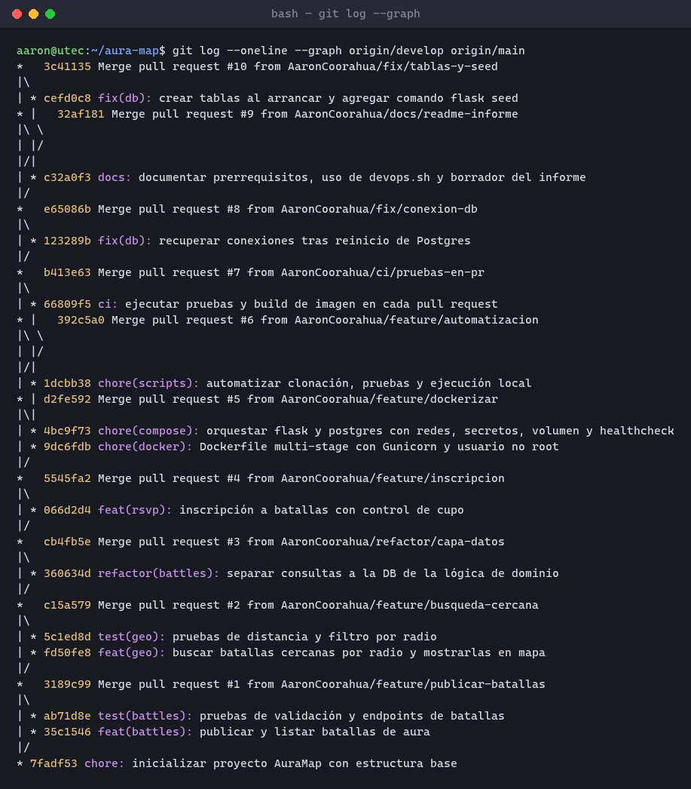

### Análisis de 6 commits (de un historial con más de 9)

**1. `35c1546` — `feat(battles): publicar y listar batallas de aura`**
Introduce el modelo `Battle`, la validación de negocio en
`app/services/battles.py` (título obligatorio, fecha futura, cupo entre 1 y
100, lat/lng en rango) y los endpoints `POST /api/battles` y
`GET /api/battles`. 4 archivos, 140 líneas agregadas. Es la primera feature
de producto real del proyecto: define el modelo de datos que usan todos los
commits siguientes (geo, rsvp, refactor de repositorios).

**2. `ab71d8e` — `test(battles): pruebas de validación y endpoints de batallas`**
Agrega 6 pruebas unitarias sobre lo anterior: payload válido, título vacío,
fecha pasada, cupo inválido, `POST` devuelve 201, `GET` lista. Un solo
archivo (`tests/test_battles.py`), 59 líneas. Ejemplo de la disciplina del
roadmap: cada feature va acompañada de su commit de pruebas por separado,
nunca mezclados.

**3. `360634d` — `refactor(battles): separar consultas a la DB de la lógica de dominio`**
Mueve las consultas SQLAlchemy de `app/routes.py` a
`app/repositories/battles.py`, dejando las rutas delgadas (solo orquestan
validación + repositorio + respuesta HTTP). 3 archivos, 34 líneas agregadas,
12 eliminadas. Es un refactor puro: ninguna prueba existente se modificó, lo
que confirma que el comportamiento externo no cambió.

**4. `4bc9f73` — `chore(compose): orquestar flask y postgres con redes, secretos, volumen y healthcheck`**
Agrega `compose.yaml` y `.env.dev.example`. Configura dos redes (`public` y
`private`, esta última `internal: true` para que Postgres no sea alcanzable
desde fuera), un secreto Docker (`pg_password`) en vez de una variable de
entorno en texto plano, un volumen (`postgres-data`) y un healthcheck con
`pg_isready` del que depende el servicio `flask` (`condition:
service_healthy`). 2 archivos, 56 líneas. Es el commit que hace reproducible
el entorno completo con un solo comando.

**5. `66809f5` — `ci: ejecutar pruebas y build de imagen en cada pull request`**
Agrega `.github/workflows/tests.yml`: en cada Pull Request hacia `develop` o
`main`, instala Python 3.12, corre `./devops.sh test` (con fallback a
`pytest` directo si el script no está) y hace `docker build` de la imagen.
1 archivo, 34 líneas. Cierra el ciclo: ya no depende de que cada persona
recuerde correr las pruebas antes de pedir revisión.

**6. `123289b` — `fix(db): recuperar conexiones tras reinicio de Postgres`**
Corrige un bug reproducido deliberadamente: con los servicios arriba,
`docker compose restart postgres` seguido de peticiones a `/api/battles`
producía `OperationalError: server closed the connection unexpectedly` en
~10% de los intentos, porque SQLAlchemy reutilizaba conexiones del pool que
Postgres ya había cerrado. El fix agrega `pool_pre_ping: True` (SQLAlchemy
verifica la conexión antes de reutilizarla) y una espera con reintentos y
backoff exponencial al arrancar la app (`app/db.py::wait_for_db`), porque
`depends_on: condition: service_healthy` solo ordena el arranque de los
contenedores y no protege si Postgres cae después. 5 archivos, incluyendo la
evidencia de antes/después en `docs/evidencias/`. Ejemplo de un fix con
reproducción documentada antes de escribir la corrección.

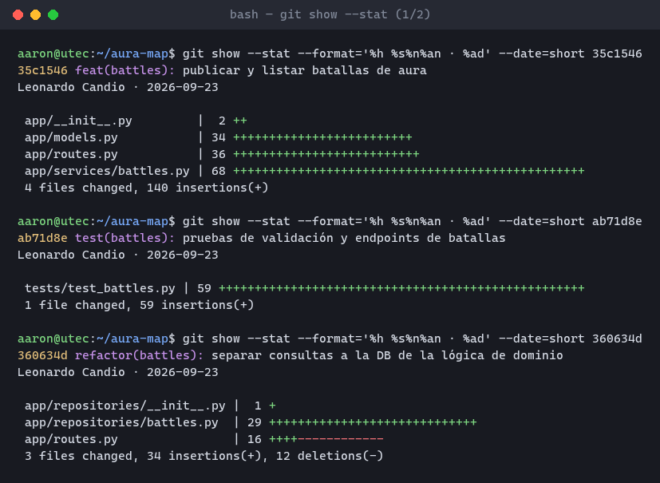

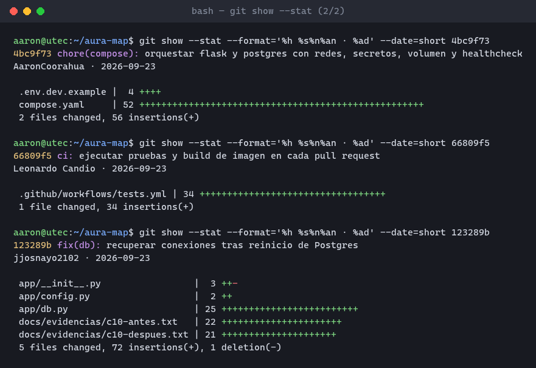

**Pull Requests según la metodología de branching:** el equipo usa GitFlow —
rama `develop` como integración, `main` como estable, y una rama por bloque
del roadmap (`feature/...`, `fix/...`, `chore/...`, `docs/...`,
`release/...`) que se integra a `develop` (o a `main` en el release) por
Pull Request con merge commit (`--no-ff`, sin squash ni rebase), siempre con
al menos un revisor asignado según la tabla de roles del roadmap.

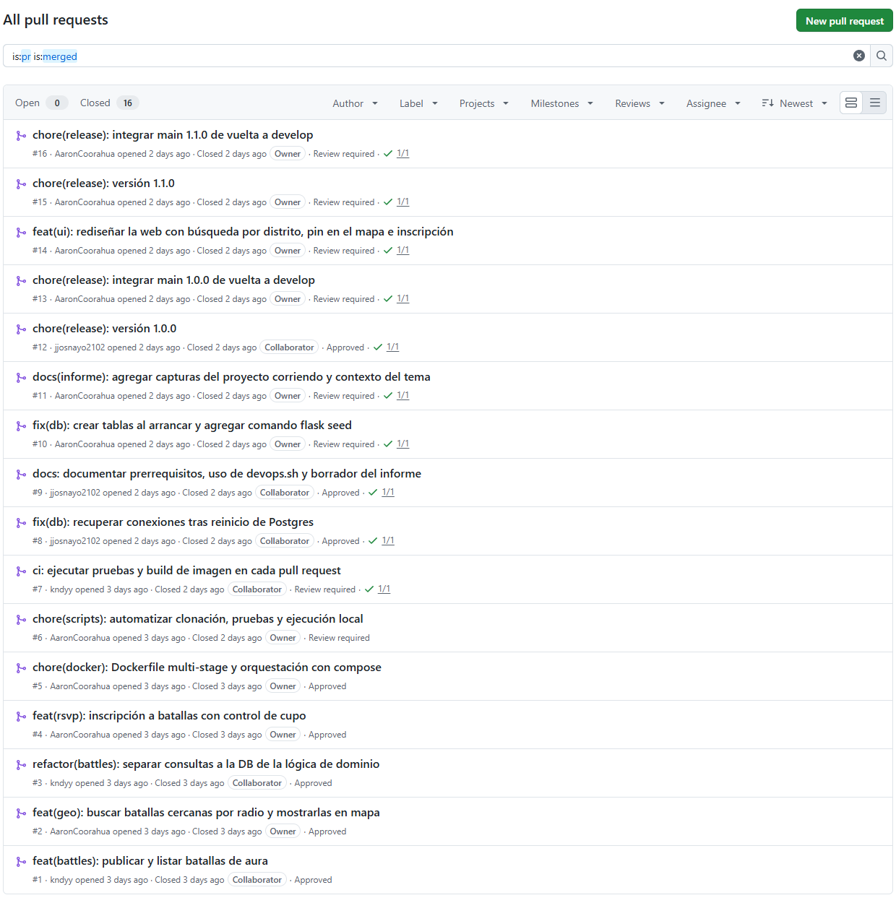

## d) Pruebas unitarias

**Herramientas:** [pytest](https://docs.pytest.org/) como framework de
pruebas y [pytest-cov](https://pytest-cov.readthedocs.io/) para el reporte de
cobertura. Las pruebas usan el test client de Flask y una base de datos
SQLite en memoria (fixture `app` en `tests/conftest.py`), por lo que no
dependen de Docker ni de Postgres para correr.

**Implementación:** 15 pruebas unitarias repartidas en 4 archivos (mínimo
exigido: 9):

| Archivo | Pruebas | Qué cubre |
|---|---|---|
| `tests/test_api.py` | 2 | `/health` responde 200 e incluye la versión. |
| `tests/test_battles.py` | 6 | Validación de payload (título vacío, fecha pasada, cupo inválido) y endpoints `POST`/`GET` de batallas. |
| `tests/test_geo.py` | 4 | `haversine_km` (mismo punto = 0, 1° de longitud en el ecuador ≈ 111.19 km), filtro por radio y coordenadas inválidas. |
| `tests/test_rsvp.py` | 3 | Inscripción con cupo disponible, rechazo por cupo lleno (409) y rechazo por duplicado (409). |

**Evidencia de ejecución:**

```
./devops.sh test
# equivalente: pytest -v --cov=app --cov-report=term-missing

15 passed in 0.79s
TOTAL cobertura: 79%
```

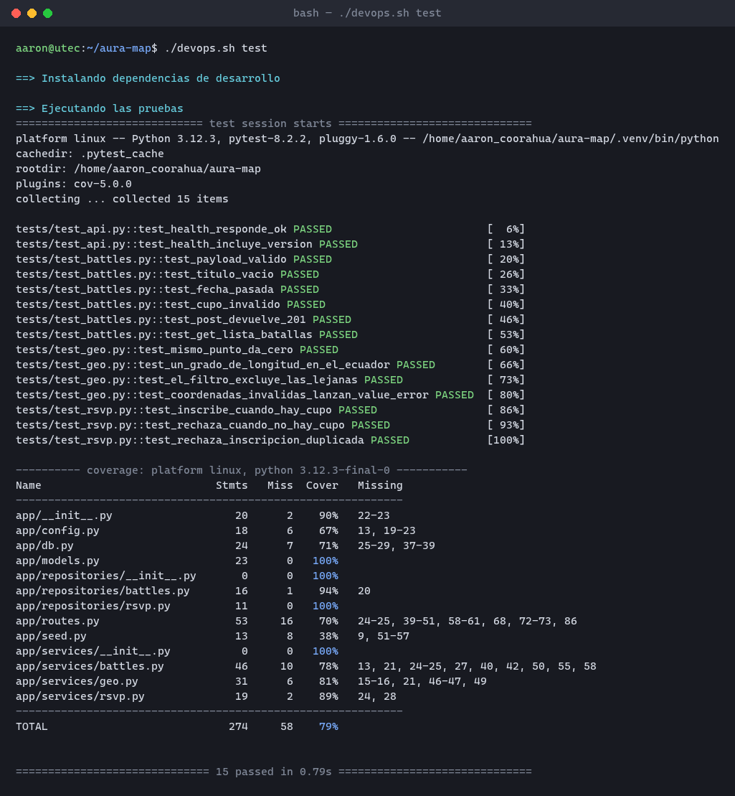

La cobertura bajó de 82% a 79% al integrar `app/seed.py` (el comando
`flask seed`), que no tiene prueba propia: es el siguiente candidato a
cubrir. Las pruebas corren en menos de un segundo porque la lógica de negocio
vive en funciones puras (`app/services/`) y la DB de prueba es SQLite en
memoria: se pueden correr en cada guardado, no solo antes de un PR.

**Las mismas reglas, probadas contra la app real.** Además de pytest,
verificamos a mano con `curl` las reglas de inscripción sobre la app corriendo
en Docker con Postgres: una batalla con cupo 2 acepta a Camila y a Yhoel
(201), rechaza a Mateo porque ya no hay cupo (409) y rechaza que Camila se
inscriba dos veces en la misma batalla (409). La búsqueda por radio de 2 km
desde el Parque Kennedy devuelve solo las batallas de Miraflores:

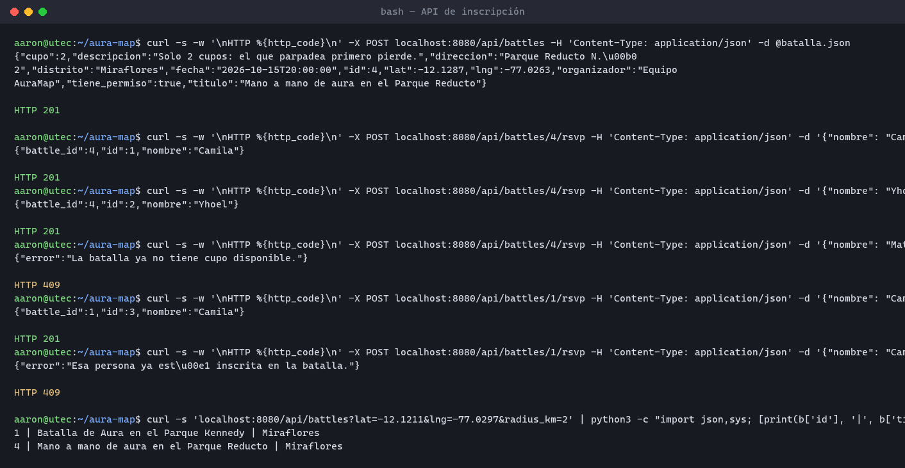

## e) Automatización en scripts bash

Todo el ciclo de desarrollo se automatiza con `devops.sh` (bash, `set -euo
pipefail`, ayuda con `-h`, compatible con Linux, macOS y Git Bash/WSL en
Windows):

- **Clonación:** `./devops.sh clone <url> [dir]` clona el repositorio, crea
  el entorno virtual e instala `requirements-dev.txt`.
- **Pruebas:** `./devops.sh test` crea el entorno virtual si falta y corre
  `pytest -v --cov=app --cov-report=term-missing`.
- **Modo local:** `./devops.sh local` levanta la app sin Docker, con SQLite
  en `instance/`, carga 3 batallas de ejemplo con `flask seed` y arranca
  `flask --app app:create_app run --debug`.

Además, `./devops.sh docker` (genera secretos y levanta Flask + Postgres),
`./devops.sh down [-v]` (baja los servicios) y `./devops.sh evidence`
(guarda las evidencias de este informe en `docs/evidencias/`).

La secuencia completa, tal como la haría un integrante nuevo desde cero
(Ubuntu en WSL, sin nada instalado del proyecto):

**1. Clonar** — clona el repo, crea el entorno virtual e instala dependencias:

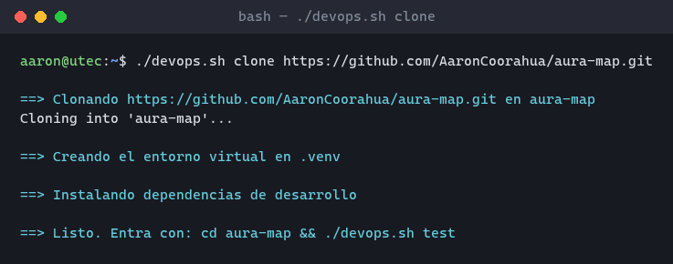

**2. Probar** — la misma salida de la sección d) (15 passed).

**3. Correr en local** — sin Docker, con SQLite y datos de ejemplo:

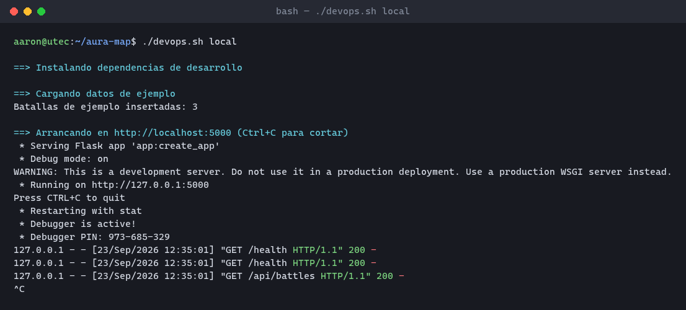

Mientras corre, desde otra terminal la API ya responde con las 3 batallas
sembradas (Miraflores, Cercado de Lima y Barranco):

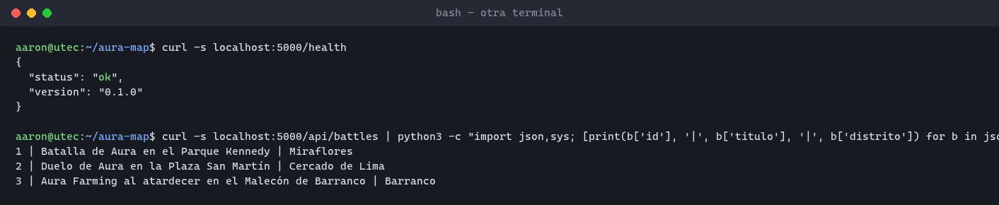

Con tres comandos alguien del equipo pasa de "no tengo nada" a "tengo la app
corriendo con datos y las pruebas en verde", sin leer un README de dos
páginas ni preguntar por WhatsApp qué versión de Python instalar.

## f) Dockerizar su aplicación

**Dockerfile:** build multi-stage. La etapa `builder` (`python:3.12-slim`)
instala las dependencias en un entorno virtual; la etapa final, también
`python:3.12-slim`, copia solo ese entorno virtual y el código de la app,
corre como usuario sin privilegios (`aura`, no root), expone el puerto 5000 y
arranca con Gunicorn en forma exec:
`CMD ["gunicorn", "--bind", "0.0.0.0:5000", "--workers", "2", ..., "app:create_app()"]`.

**Docker Compose — servicio web (Flask + Gunicorn):**

```yaml
flask:
  image: aura-map:latest
  build:
    context: .
    dockerfile: Dockerfile
  ports:
    - "8080:5000"
  env_file:
    - .env.dev
  environment:
    APP_VERSION: "0.1.0"
    DB_HOST: postgres
    DB_DATABASE: auradb
    DB_USER: aurauser
  networks:
    - public
    - private
  depends_on:
    postgres:
      condition: service_healthy
```

**Docker Compose — base de datos (Postgres):**

```yaml
postgres:
  image: postgres:16.3
  environment:
    POSTGRES_USER: aurauser
    POSTGRES_DB: auradb
    POSTGRES_PASSWORD_FILE: /run/secrets/pg_password
  secrets:
    - pg_password
  volumes:
    - postgres-data:/var/lib/postgresql/data
  networks:
    - private
  healthcheck:
    test: ["CMD-SHELL", "pg_isready -U aurauser -d auradb"]
    interval: 5s
    timeout: 5s
    retries: 5
```

Postgres no publica puertos al host (solo es alcanzable desde la red
`private`, que es `internal: true`); su contraseña se inyecta por Docker
secret (`secrets/pg_password.txt`, ignorado por git), nunca en texto plano en
`compose.yaml`.

**Evidencia de la aplicación corriendo en Docker.** Con un solo comando se
generan los secretos, se construye la imagen, se crean las redes y el volumen,
se espera a que Postgres esté *healthy*, se prueba `/health` y se cargan las
batallas de ejemplo:

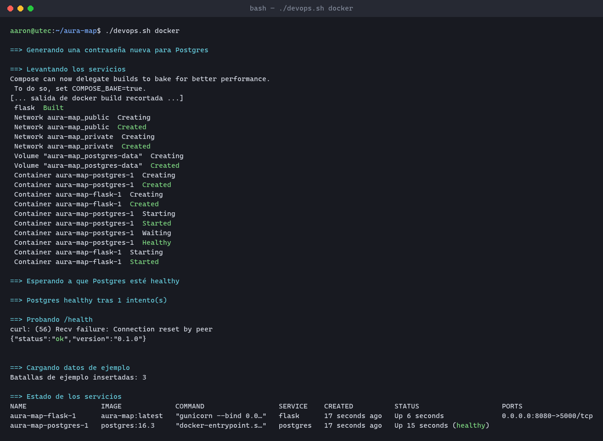

El `curl: (56) Recv failure` que aparece una vez no es un error: es
`devops.sh` reintentando `/health` mientras Gunicorn termina de arrancar
(Postgres *healthy* no significa que Flask ya esté escuchando). Al segundo
intento responde `{"status":"ok"}`.

**Verificación de aislamiento.** `./devops.sh evidence` confirma que la red
`private` es `internal=true` y que Postgres no publica el puerto 5432 al host:
la base de datos solo es alcanzable desde el contenedor de Flask.

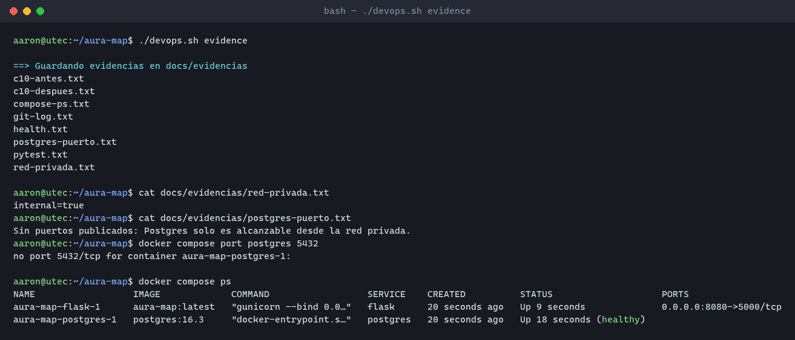

**La app en el navegador** (`http://localhost:8080`). Nadie busca un evento
escribiendo latitud y longitud, así que la interfaz habla en el idioma de
Lima: a la izquierda las batallas como tarjetas (fecha, lugar, organizador,
permiso municipal y una barra con los cupos que quedan) y a la derecha el
mapa. Al tocar una tarjeta el mapa vuela al pin y abre su ficha:

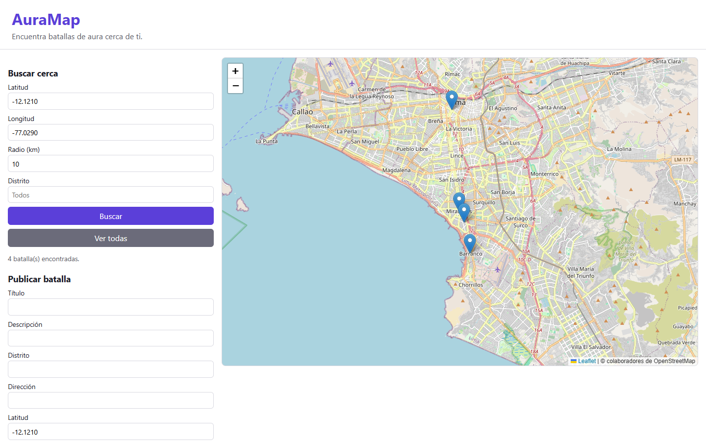

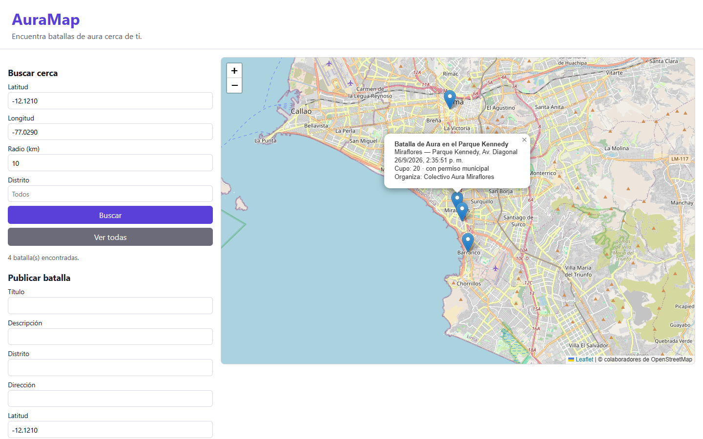

**Buscar como humano.** En "¿Dónde quieres buscar?" se elige un distrito de
Lima o "Cerca de mí" (usa la ubicación del celular) y una distancia máxima
en chips (2, 5, 10 o 20 km). El mapa dibuja el radio y cada tarjeta muestra a
cuántos km queda. Aquí, batallas a menos de 2 km de Miraflores:

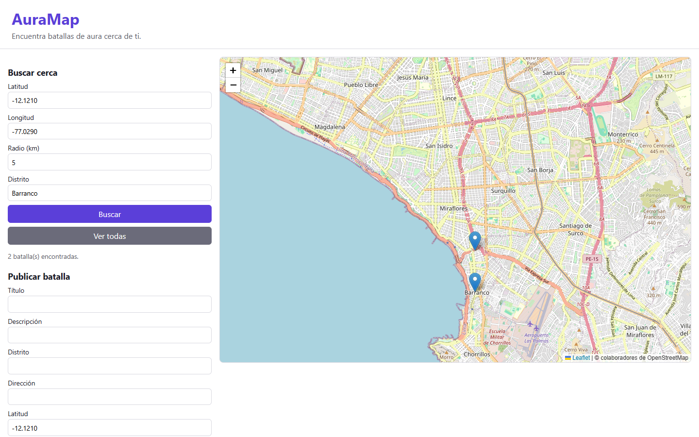

**Inscribirse en dos toques.** El botón "Inscribirme" pide solo un nombre; si
la batalla se llenó o esa persona ya está inscrita, el mismo diálogo muestra
el error de la API (409) en lenguaje humano:

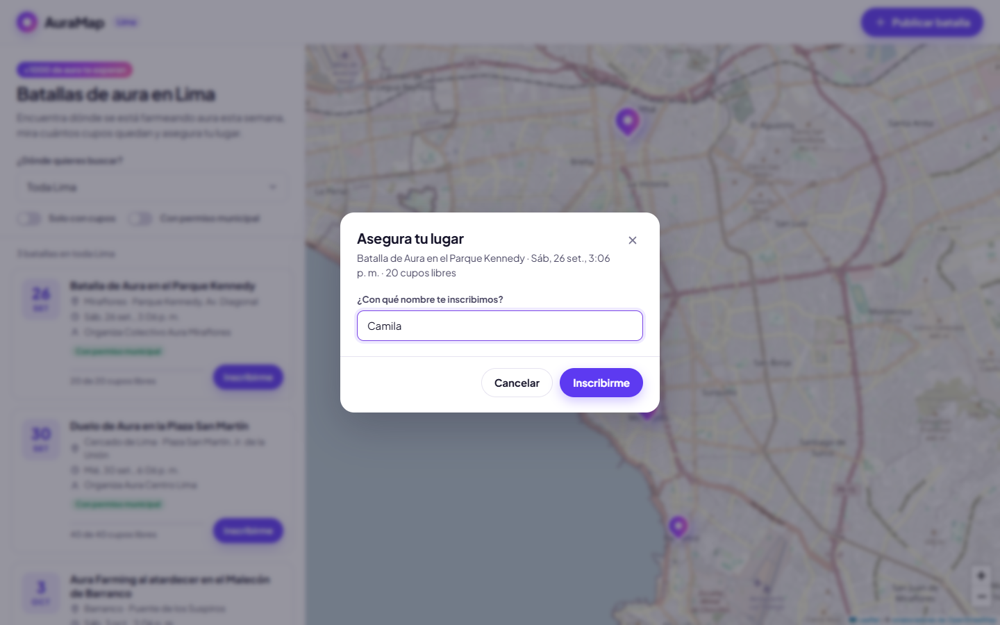

**Publicar sin coordenadas.** El organizador elige el distrito, el minimapa
se centra ahí y basta con tocar o arrastrar el pin hasta el lugar exacto. Las
reglas se validan en el navegador y otra vez en el backend (fecha futura,
cupo 1–100, coordenadas válidas); al publicar, la batalla aparece al instante
en el mapa, guardada en Postgres:

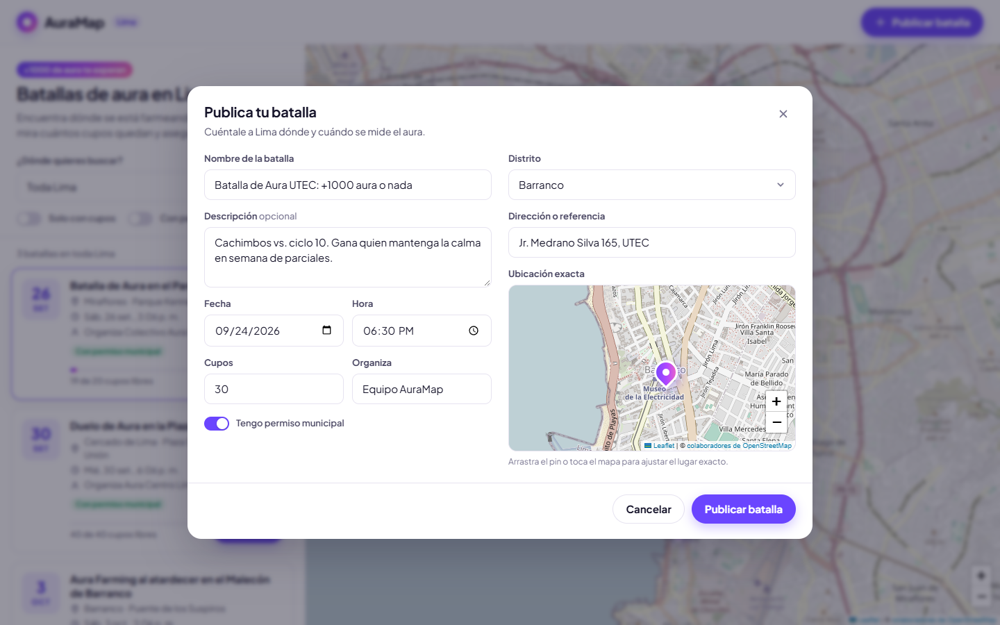

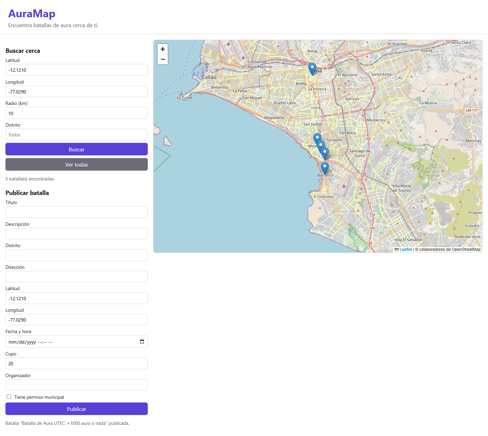

**Pensada para celular**, que es donde se comparten estas batallas: el mapa
pasa arriba y la lista abajo, sin scroll horizontal.

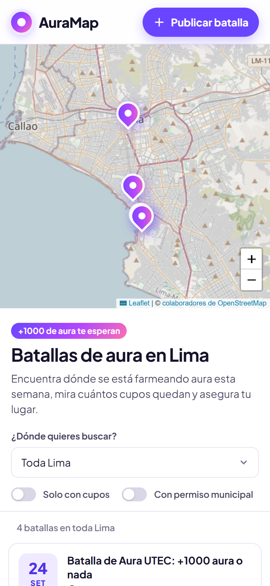

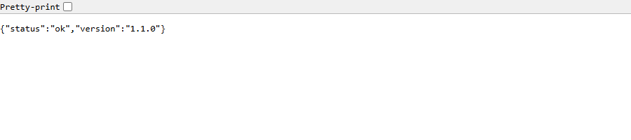

**Un hallazgo que solo apareció al dockerizar.** En la primera corrida con
Postgres, `/api/battles` respondía 500 (`relation "battle" does not exist`):
las pruebas usan SQLite en memoria y crean las tablas en el fixture, así que
nunca vieron el problema. Lo detectó C al reproducir el bug de `fix(db)` y se
corrigió en `fix(db): crear tablas al arrancar y agregar comando flask seed`
(PR #10): `create_app` crea las tablas que falten (tolerando que los 2
workers de Gunicorn lo intenten a la vez) y `flask seed` carga los datos de
ejemplo.

## g) Conclusiones preliminares

- **Git con convenciones claras:** usar Conventional Commits desde el primer
  commit y un roadmap con un ID y un mensaje fijo por bloque eliminó la
  ambigüedad de "qué se supone que hace este commit" al revisar PRs entre 3
  personas trabajando en paralelo. La trazabilidad se nota en la práctica: el
  bug de `fix(db)` (commit `123289b`) se pudo documentar y revisar sin
  necesidad de explicación extra, porque el tipo y el alcance del commit ya
  dicen qué se tocó y por qué.
- **Pruebas unitarias:** correr las 15 pruebas en menos de 2 segundos, sin
  Docker ni Postgres, permitió refactorizar (`360634d`) con la garantía de
  que el comportamiento externo no cambiaba, y detectar en CI cualquier
  regresión antes de mergear. La cobertura (79%) además señala qué ramas del
  código (sobre todo manejo de errores en rutas) todavía no están probadas.
- **Dockerizar la aplicación:** reproducir el entorno completo con un solo
  comando (`./devops.sh docker`) hizo posible reproducir de forma
  determinística un bug real (conexiones caídas tras reiniciar Postgres) en
  vez de solo poder discutirlo en teoría, y las redes/secretos/healthcheck de
  `compose.yaml` obligan a modelar desde el inicio cómo se comunican los
  servicios en producción, no solo en la laptop de cada integrante.

- **Probar en el entorno real, no solo en el de pruebas:** 15 pruebas en
  verde no impidieron que la app fallara con una base de datos nueva en
  Postgres. El entorno reproducible de Docker fue lo que hizo visible esa
  diferencia entre SQLite en memoria y producción; la lección para el final
  del curso es agregar una prueba de humo contra `docker compose` en el CI.
- **El producto también importa:** elegir un tema que el equipo y sus
  compañeros entienden al toque (el meme del aura) hizo que las reglas de
  negocio salieran naturales —cupo, duplicados, permiso municipal— y que la
  demo se explique sola: publicas tu batalla, la gente la encuentra en el mapa
  y se inscribe antes de que se llene.

## Anexo: evidencias

- Capturas de pantalla: [`imagenes/`](../imagenes/) (numeradas en el orden
  en que aparecen en este informe).
- Salidas de comandos en texto: [`docs/evidencias/`](evidencias/), generadas
  con `./devops.sh evidence` (`git-log.txt`, `pytest.txt`,
  `compose-ps.txt`, `health.txt`, `red-privada.txt`, `postgres-puerto.txt`)
  más el antes/después del bug de conexiones (`c10-antes.txt`,
  `c10-despues.txt`).
